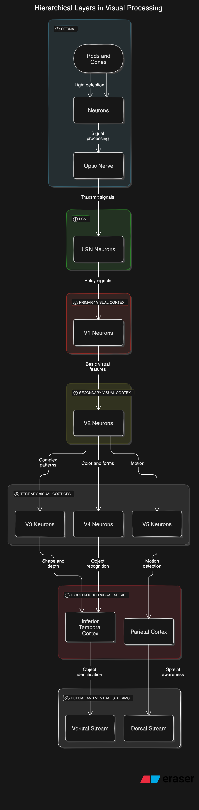

# Session 1 - Introduction to Computer Vision

COURSE FLOW

- 25 Classes
- Aug to Oct
- 2 classes/week (Sat/Sun)  6PM IST
- Session recording
- Doubt Clearance (Tue 8PM IST)
- Assignments

## Computer Vision
Computer Vision is a field of artificial intelligence (AI) and computer science that focuses on enabling machines to interpret and understand the visual world, similar to how humans perceive and process visual information. It involves the development of algorithms and models that allow computers to extract meaningful information from images, videos, and other visual inputs.

### Key Aspects of Computer Vision:
1. **Image Processing**: Techniques to enhance or manipulate images, such as filtering, edge detection, and noise reduction.
2. **Object Detection**: Identifying and locating objects within an image or video frame, such as detecting cars in a traffic video.
3. **Image Classification**: Assigning a label or category to an entire image, such as recognizing whether an image contains a cat or a dog.
4. **Segmentation**: Dividing an image into segments or regions to isolate specific objects or areas, such as segmenting a person from the background.
5. **Facial Recognition**: Identifying or verifying individuals based on their facial features.
6. **Optical Character Recognition (OCR)**: Converting text within images into machine-readable text.
7. **3D Vision**: Understanding the three-dimensional structure of objects or scenes from 2D images, often used in robotics and autonomous vehicles.
8. **Motion Analysis**: Tracking and analyzing movement within a video sequence, such as human motion analysis in sports.

### Applications:
- **Healthcare**: Medical imaging analysis, such as detecting tumors in X-rays or MRIs.
- **Autonomous Vehicles**: Enabling self-driving cars to recognize and respond to road conditions, signs, and obstacles.
- **Retail**: Automated checkout systems and inventory management using visual recognition.
- **Security**: Surveillance systems that detect and alert for suspicious activities.
- **Agriculture**: Monitoring crop health and growth through aerial images.
- **Manufacturing**: Quality control by detecting defects in products.

Computer Vision is a rapidly evolving field with advancements driven by deep learning and neural networks, which have significantly improved the accuracy and efficiency of visual recognition tasks.

## Prerequisites

The prerequisites for learning and working in Computer Vision include a mix of foundational knowledge in mathematics, programming, and machine learning, as well as specific skills related to image processing and deep learning. Here’s a breakdown:

### 1. **Mathematics**
   - **Linear Algebra**: Understanding matrices, vectors, eigenvalues, eigenvectors, and matrix operations, as they are essential for image transformations, feature extraction, and deep learning algorithms.
   - **Calculus**: Knowledge of differentiation and integration, especially for understanding optimization techniques used in training neural networks.
   - **Probability and Statistics**: Basics of probability theory, statistical inference, and distributions are important for algorithms like object detection, image classification, and in handling uncertainty in model predictions.

### 2. **Programming**
   - **Python**: Proficiency in Python is crucial as it's the primary language used in most Computer Vision libraries and frameworks.
   - **Libraries and Frameworks**:
     - **OpenCV**: A widely used library for image processing tasks.
     - **NumPy**: Essential for numerical operations and array manipulations.
     - **Pandas**: For data manipulation and analysis.
     - **Matplotlib/Seaborn**: For data visualization.
     - **TensorFlow/PyTorch/Keras**: For building and training deep learning models.
   - **C/C++**: Some Computer Vision applications require real-time processing, where C/C++ might be used for performance optimization.

### 3. **Image Processing Basics**
   - **Image Representation**: Understanding how images are represented digitally (pixels, color channels, etc.).
   - **Image Manipulation**: Basic operations like resizing, cropping, filtering, and transforming images.
   - **Understanding of Filters**: Knowledge of edge detection (Sobel, Canny), smoothing (Gaussian), and sharpening filters.

### 4. **Machine Learning and Deep Learning**
   - **Basic ML Concepts**: Understanding of classification, regression, clustering, and evaluation metrics.
   - **Deep Learning**: Familiarity with neural networks, especially Convolutional Neural Networks (CNNs), which are central to many Computer Vision tasks.
   - **Transfer Learning**: Knowledge of using pre-trained models for various Computer Vision tasks.
   - **Model Optimization**: Understanding how to fine-tune models, perform hyperparameter tuning, and apply techniques like dropout, batch normalization, and data augmentation.

### 5. **Domain Knowledge**
   - **Image Data**: Understanding the nature of image data, including the challenges such as noise, lighting conditions, and varying object scales.
   - **Project-Based Learning**: Building projects such as image classification, object detection, facial recognition, and others to apply theoretical knowledge.

### 6. **Familiarity with Computer Vision Tools**
   - **Annotation Tools**: Tools like LabelImg for annotating images for tasks like object detection.
   - **Dataset Handling**: Managing and working with large datasets, such as ImageNet, COCO, or custom datasets.

### 7. **Understanding of Hardware Requirements**
   - **GPUs**: Knowledge of using GPUs for accelerating deep learning model training.
   - **Edge Devices**: Understanding the deployment of Computer Vision models on edge devices like Raspberry Pi, NVIDIA Jetson, etc.

### 8. **Mathematical Optimization**
   - **Gradient Descent**: Understanding how optimization algorithms like gradient descent work in training models.
   - **Loss Functions**: Knowledge of different loss functions and how they influence model training.

Building a solid foundation in these areas will greatly enhance your ability to understand and work on complex Computer Vision problems.


The history of Computer Vision is a fascinating journey that spans several decades, evolving from basic image processing techniques to advanced deep learning models capable of performing complex visual tasks. Here's an overview of the key milestones in the history of Computer Vision:

### 1950s-1960s: The Early Beginnings
- **1950s**: The concept of using machines to interpret visual information was first explored in the 1950s. Early work focused on processing images to detect simple patterns and shapes.
- **1963**: Larry Roberts, often considered the "father of Computer Vision," developed methods for extracting 3D information from 2D images. His PhD thesis laid the groundwork for object recognition and the interpretation of 3D scenes from 2D images.
- **1966**: Marvin Minsky initiated the "Summer Vision Project" at MIT, intending to solve vision in a summer, but it revealed the complexity of the task. The project aimed to have a computer identify objects in images, but it quickly became clear that understanding visual data was far more challenging than anticipated.

### 1970s: Foundations of Image Processing
- **1970s**: Research in this decade focused on developing algorithms for basic image processing tasks, such as edge detection, segmentation, and image enhancement.
- **1973**: David Marr proposed a framework for understanding visual perception, introducing the idea that vision can be understood at different levels of abstraction. His theories on how the human brain interprets visual information heavily influenced the development of Computer Vision algorithms.

### 1980s: Emergence of Object Recognition
- **1980s**: This decade saw significant advancements in object recognition and feature extraction. Researchers began developing techniques to recognize objects based on their shape, texture, and color.
- **1986**: The concept of optical flow, a method to estimate motion between frames in a video sequence, was developed by Berthold K. P. Horn and Brian G. Schunck. Optical flow became a fundamental technique in motion analysis.

### 1990s: Advances in Machine Learning and Real-Time Vision
- **1990s**: The rise of machine learning techniques began to influence Computer Vision. Researchers started using statistical methods to improve image recognition and classification.
- **1998**: Yann LeCun and his team developed LeNet, one of the first Convolutional Neural Networks (CNNs). LeNet was successfully applied to handwritten digit recognition (MNIST dataset) and laid the foundation for modern deep learning in Computer Vision.

### 2000s: The Era of Feature-Based Methods
- **Early 2000s**: Feature-based methods such as SIFT (Scale-Invariant Feature Transform) and SURF (Speeded-Up Robust Features) became popular for detecting and describing local features in images. These methods were used in tasks like image stitching, object recognition, and 3D reconstruction.
- **2006**: The advent of large-scale image datasets like ImageNet marked a turning point in Computer Vision. ImageNet provided millions of labeled images, enabling the training of more complex and accurate models.

### 2010s: The Deep Learning Revolution
- **2012**: The breakthrough came with the introduction of AlexNet, a deep convolutional neural network that won the ImageNet Large Scale Visual Recognition Challenge (ILSVRC) by a significant margin. Developed by Alex Krizhevsky, Ilya Sutskever, and Geoffrey Hinton, AlexNet demonstrated the power of deep learning in Computer Vision.
- **2014**: The introduction of Generative Adversarial Networks (GANs) by Ian Goodfellow and colleagues revolutionized image generation and synthesis, allowing machines to create realistic images from scratch.
- **2015**: The development of advanced models like VGGNet, ResNet, and Inception further pushed the boundaries of image classification, object detection, and segmentation. ResNet, in particular, introduced the concept of residual learning, allowing the training of very deep networks without suffering from the vanishing gradient problem.
- **2015**: The release of TensorFlow by Google made it easier for researchers and developers to implement and experiment with deep learning models, accelerating innovation in the field.

### 2020s: Current Trends and Future Directions
- **2020s**: The focus in Computer Vision has shifted towards real-time applications, edge computing, and the integration of multimodal data (e.g., combining vision with natural language processing). Transformer-based architectures like Vision Transformers (ViTs) have started gaining popularity, showing strong performance in various vision tasks.
- **Autonomous Vehicles and Robotics**: Computer Vision is playing a crucial role in the development of autonomous vehicles, enabling them to perceive and navigate their environment. Similarly, advancements in robotics rely heavily on vision for tasks like object manipulation and navigation.
- **Healthcare**: The use of Computer Vision in medical imaging has seen tremendous growth, with AI models assisting in the detection of diseases such as cancer, heart disease, and neurological disorders.

### Impact of Computer Vision
The evolution of Computer Vision has had a profound impact on many industries, including healthcare, automotive, security, entertainment, and retail. The field continues to evolve rapidly, with ongoing research pushing the boundaries of what machines can achieve in terms of visual perception and understanding.

The human visual cortex is a critical part of the brain responsible for processing visual information received from the eyes. It's located in the occipital lobe at the back of the brain and is highly specialized for interpreting the various aspects of visual stimuli, such as color, motion, shape, and depth. Understanding how the visual cortex works provides insight into how humans perceive the world around them.

### Structure of the Visual Cortex

The visual cortex is divided into several distinct areas, each responsible for different aspects of visual processing:

1. **Primary Visual Cortex (V1)**
   - **Location**: The V1 area is the first stage of cortical processing of visual information. It's also known as the striate cortex due to the stripe-like appearance of myelinated fibers.
   - **Function**: V1 receives input directly from the retina via the lateral geniculate nucleus (LGN) of the thalamus. It processes basic visual elements such as edge orientation, spatial frequency, and motion direction.
   - **Mapping**: The visual cortex has a retinotopic map, meaning that specific areas of the visual field correspond to specific areas in V1. This map is like a distorted representation of the visual field, where more neurons are dedicated to processing information from the center of the visual field (fovea) than the periphery.

2. **Secondary Visual Cortex (V2)**
   - **Function**: V2 is involved in further processing the information received from V1. It starts integrating features to detect more complex patterns, such as contours and object boundaries.
   - **Connection**: V2 sends information to higher visual areas (V3, V4, etc.) for more specialized processing.

3. **Tertiary Visual Cortices (V3, V4, V5/MT)**
   - **V3**: This area is involved in processing the shape and depth of objects.
   - **V4**: Specializes in processing color and form. Damage to V4 can lead to a condition known as achromatopsia, where a person loses the ability to perceive color.
   - **V5/MT (Middle Temporal Area)**: Critical for processing motion. Neurons in V5 are highly sensitive to the direction and speed of moving objects.

### Processing Visual Information

The processing of visual information in the cortex follows a hierarchical and parallel structure:

1. **Retina and Optic Nerve**: The process begins in the retina, where light is converted into neural signals by photoreceptors (rods and cones). These signals are then transmitted through the optic nerve to the brain.

2. **Lateral Geniculate Nucleus (LGN)**: Before reaching the cortex, visual information is relayed through the LGN in the thalamus. The LGN acts as a gateway, organizing the information and sending it to the primary visual cortex (V1).

3. **Hierarchical Processing**: 
   - In V1, the visual information is broken down into simple features like edges, orientations, and contrasts.
   - V2 and higher areas (V3, V4, V5) build upon this information to recognize more complex features like shapes, colors, and motion.

4. **Parallel Processing**:
   - The brain processes different aspects of the visual scene in parallel through different pathways:
     - **Dorsal Stream ("Where Pathway")**: Extends from V1 to V5/MT and beyond, processing spatial location, movement, and coordination of actions relative to objects.
     - **Ventral Stream ("What Pathway")**: Extends from V1 through V4 and beyond, responsible for object recognition, color, and form processing.

### Specialization and Plasticity

- **Neuronal Specialization**: Different neurons within the visual cortex are specialized to respond to specific types of visual stimuli. For example, some neurons may only respond to vertical edges, while others respond to horizontal ones.
- **Plasticity**: The visual cortex exhibits a degree of plasticity, particularly in early development. For example, if a person is deprived of visual input in one eye during childhood, the visual cortex can adapt, potentially reallocating resources to the other eye. This plasticity diminishes with age.

### Higher-Order Processing

- **Integration with Other Brain Areas**: The visual cortex is not working in isolation. It integrates information from other sensory modalities (like auditory and tactile information) and higher cognitive functions (such as memory and attention) to create a comprehensive perception of the environment.
- **Face and Object Recognition**: Specialized regions in the brain, such as the Fusiform Face Area (FFA) in the fusiform gyrus, are involved in recognizing faces, while other regions are specialized for recognizing specific categories of objects.

### Disorders Related to the Visual Cortex

- **Visual Agnosia**: A condition where a person can see but cannot recognize or interpret visual information, usually due to damage in the ventral stream.
- **Motion Blindness (Akinetopsia)**: A rare disorder where a person cannot perceive motion, often linked to damage in the V5/MT area.
- **Blindsight**: A condition where individuals with damage to V1 can respond to visual stimuli without consciously perceiving them, suggesting some visual processing occurs outside of conscious awareness.

The human visual cortex is a highly complex and specialized system that allows us to perceive and interact with the visual world in intricate ways. It demonstrates the brain's remarkable ability to process vast amounts of visual data and translate it into meaningful perceptions.


An image is a visual representation of objects, scenes, or concepts, captured or created using various methods, such as photography, painting, or digital rendering. Images can be static (like photographs or paintings) or dynamic (like videos or animations). They play a fundamental role in communication, art, science, and technology, providing a way to convey complex information quickly and efficiently.

### Key Components of an Image

1. **Pixels**
   - **Definition**: A pixel (short for "picture element") is the smallest unit of a digital image. It is a tiny square or dot that holds a specific color and brightness. In a digital image, thousands or millions of pixels come together to form the complete picture.
   - **Resolution**: The number of pixels in an image is referred to as its resolution, typically expressed as width × height (e.g., 1920 × 1080 pixels). Higher resolution means more pixels, which generally results in finer detail.

2. **Color**
   - **Color Models**: Images are often represented using color models like RGB (Red, Green, Blue) for digital screens or CMYK (Cyan, Magenta, Yellow, Key/Black) for printing.
     - **RGB Model**: Each pixel in an RGB image has three components (red, green, and blue), and by varying the intensity of these components, a wide range of colors can be produced.
     - **Grayscale**: In grayscale images, each pixel represents a shade of gray, ranging from black to white. This is often used in black-and-white photography or for certain types of image processing.
   - **Bit Depth**: This refers to the number of bits used to represent the color of each pixel. Common bit depths include 8-bit (256 colors), 16-bit, and 24-bit (16.7 million colors). Higher bit depth allows for more accurate color representation.

3. **File Formats**
   - **JPEG**: A commonly used format for digital photos, JPEG is a lossy format, meaning some data is compressed and lost to reduce file size.
   - **PNG**: A lossless format that supports transparency, making it ideal for graphics and images that require high quality and no loss of detail.
   - **GIF**: A format that supports simple animations and transparency but is limited to 256 colors.
   - **TIFF**: A high-quality, lossless format often used in professional photography and printing.
   - **BMP**: An uncompressed format that retains all image data, but results in large file sizes.
   - **SVG**: A vector image format that describes images using geometric shapes, making it scalable without loss of quality.

### Types of Images

1. **Raster Images**
   - **Description**: Raster images (or bitmap images) are composed of a grid of pixels. Each pixel has a fixed position and color value.
   - **Common Uses**: Photographs, digital paintings, and detailed graphics.
   - **Advantages**: Excellent for detailed and complex images with subtle color gradients.
   - **Disadvantages**: Raster images can lose quality when scaled up, leading to pixelation.

2. **Vector Images**
   - **Description**: Vector images use mathematical formulas to define geometric shapes such as lines, circles, and polygons. Instead of pixels, they use paths to represent the image.
   - **Common Uses**: Logos, icons, and illustrations.
   - **Advantages**: Vector images can be scaled infinitely without losing quality, making them ideal for logos and other designs that need to be resized frequently.
   - **Disadvantages**: Not suitable for complex images like photographs.

3. **3D Images**
   - **Description**: 3D images represent objects in three dimensions (width, height, and depth). These images are often created using 3D modeling software and can be rendered to appear realistic.
   - **Common Uses**: Video games, movies, virtual reality, and scientific visualization.
   - **Advantages**: Can provide realistic representations of objects, including depth and perspective.
   - **Disadvantages**: More complex to create and require more computing power to render.

### Image Processing

Image processing involves manipulating an image to enhance its quality or extract useful information. This is a key area in computer vision, photography, and various scientific fields.

1. **Enhancement**: Improving the visual quality of an image. Techniques include contrast adjustment, sharpening, noise reduction, and color correction.
2. **Filtering**: Applying filters to achieve specific effects or to highlight certain features within an image. Examples include edge detection, blurring, and embossing.
3. **Segmentation**: Dividing an image into parts or segments, often to isolate objects or regions of interest. This is widely used in medical imaging and computer vision.
4. **Compression**: Reducing the file size of an image. Lossy compression (like JPEG) reduces file size by removing some image data, while lossless compression (like PNG) retains all data but achieves less compression.
5. **Recognition**: Using algorithms to identify objects, patterns, or features within an image. This is the basis of technologies like facial recognition, optical character recognition (OCR), and automated image tagging.

### Perception of Images

Humans perceive images through a combination of biological processes and psychological interpretation. Our brains are incredibly efficient at recognizing patterns, identifying objects, and understanding the context of images.

1. **Visual Cortex**: The part of the brain that processes visual information, allowing us to interpret and understand images.
2. **Gestalt Principles**: A set of principles in psychology that describe how humans naturally organize visual elements into groups or unified wholes. For example, we tend to see a series of dots as a line if they are close together.
3. **Color Perception**: Human eyes are sensitive to specific wavelengths of light, which we perceive as different colors. Color perception can be influenced by lighting, context, and individual differences.

### Applications of Images

Images are used in virtually every field and have countless applications:

1. **Art and Design**: Images are a primary medium in visual arts, graphic design, and advertising, where they convey ideas, evoke emotions, and create visual impact.
2. **Communication**: Images are used in media, social networks, and presentations to communicate messages more effectively than text alone.
3. **Science and Medicine**: Medical imaging (like MRI, X-rays, and ultrasound) allows doctors to see inside the body, while scientific imaging helps researchers observe phenomena at various scales.
4. **Technology**: Images are central to many technologies, from the graphical user interfaces (GUIs) of computers and smartphones to virtual and augmented reality (VR/AR).
5. **Security and Surveillance**: Images and video are used for monitoring, facial recognition, and other security applications.

### Summary

An image is a fundamental and versatile medium that transcends language and cultural barriers. Whether in the form of a simple photograph, a complex digital rendering, or a scientific visualization, images play a critical role in how we perceive and interact with the world. Through advancements in technology, the creation, manipulation, and understanding of images continue to evolve, opening new possibilities for communication, art, science, and beyond.
In computer vision, **RGB** and **grayscale** images represent two different ways of encoding and processing visual information, each with its specific use cases and advantages. Let's break down what these terms mean and how they are used in computer vision.

### RGB Images

**RGB** stands for **Red, Green, Blue**, which are the three primary colors used in digital imaging to represent a wide spectrum of colors.

#### 1. **Structure of RGB Images**
   - **Channels**: An RGB image consists of three color channels: red, green, and blue. Each channel is essentially a grayscale image representing the intensity of that particular color across the image.
   - **Pixel Values**: Each pixel in an RGB image is defined by a combination of three values (one for each channel), typically ranging from 0 to 255. For example, a pixel with the value (255, 0, 0) would be pure red, (0, 255, 0) would be pure green, and (0, 0, 255) would be pure blue.
   - **Color Representation**: By combining different intensities of red, green, and blue, an RGB image can represent millions of different colors. For example, (255, 255, 0) would represent yellow, and (128, 128, 128) would be a shade of gray.

#### 2. **Use in Computer Vision**
   - **Color Information**: RGB images are used when color information is essential. Applications such as object detection, facial recognition, and image classification often rely on RGB images because the color can provide crucial information about the content of the image.
   - **Complexity**: Processing RGB images can be more computationally intensive than grayscale images because there are three channels to consider, each of which must be processed separately.
   - **Examples**: RGB images are commonly used in applications where identifying or distinguishing objects based on color is important, such as traffic sign recognition, medical imaging (e.g., skin lesions), and consumer applications like image editing software.

### Grayscale Images

**Grayscale** images represent visual information using shades of gray, ranging from black to white.

#### 1. **Structure of Grayscale Images**
   - **Single Channel**: A grayscale image has only one channel, which represents the intensity of light at each pixel. This intensity value typically ranges from 0 to 255, where 0 corresponds to black, 255 to white, and intermediate values represent various shades of gray.
   - **Pixel Values**: Each pixel in a grayscale image is defined by a single value (0-255), representing the brightness of the pixel. For example, a pixel with a value of 0 is black, and one with a value of 255 is white.

#### 2. **Use in Computer Vision**
   - **Simplicity**: Grayscale images are simpler to process because there is only one channel. This makes them faster to compute and requires less memory than RGB images.
   - **Focus on Intensity**: Grayscale images are often used in tasks where color is not important or where only the intensity of light is relevant, such as in edge detection, texture analysis, and some forms of image segmentation.
   - **Examples**: Grayscale images are commonly used in applications like document scanning, where the focus is on text or shapes, or in medical imaging (e.g., X-rays) where color is not necessary. They are also used in many machine learning models where reducing the data complexity can improve performance.

### Comparison of RGB and Grayscale in Computer Vision

1. **Data Size and Complexity**:
   - **RGB**: Three times larger data size (three channels) and more complex to process.
   - **Grayscale**: Smaller data size (one channel) and simpler to process.

2. **Color Information**:
   - **RGB**: Contains full color information, making it suitable for tasks where color is a key feature.
   - **Grayscale**: Lacks color information, focusing only on brightness, which is useful in tasks where color is not important.

3. **Applications**:
   - **RGB**: Used in tasks where distinguishing between different colors is crucial, such as object recognition, image classification, and any application where color is a defining feature.
   - **Grayscale**: Used in applications where color is irrelevant, and the focus is on patterns, textures, or shapes, such as in medical imaging, document analysis, and certain types of image processing like edge detection.

4. **Conversion**:
   - **Converting RGB to Grayscale**: This is often done by averaging the three RGB values or using a weighted sum that takes into account the human eye's sensitivity to different colors (e.g., giving more weight to green).
   - **Impact of Conversion**: While converting an RGB image to grayscale reduces data size and simplifies processing, it can also lead to a loss of information, particularly if color is a significant feature of the image.

### Summary

In computer vision, RGB and grayscale images serve different purposes depending on the requirements of the task. RGB images are rich in color information and are used in applications where this information is crucial. Grayscale images, being simpler and more computationally efficient, are used when color is not necessary, allowing for faster processing and often more straightforward analysis. The choice between using RGB or grayscale images depends on the specific goals of the computer vision application at hand.

### RGB and Grayscale Images in Computer Vision and Mathematics

In computer vision, images are often represented and processed in different formats, with RGB (Red, Green, Blue) and Grayscale being two of the most common. Understanding these formats mathematically helps in various image processing tasks such as filtering, enhancement, object detection, and more.

#### 1. **RGB Images**

**a. Definition:**
   - RGB images are color images that represent each pixel using three color channels: Red, Green, and Blue. Each channel contains intensity values that range from 0 to 255 in an 8-bit image, representing how much of that color is present in the pixel.
   - An RGB image is typically stored as a 3D matrix (or tensor) with dimensions corresponding to the height, width, and the three color channels.

**b. Mathematical Representation:**
   - An RGB image can be represented as a matrix \( I \) of size \( H \times W \times 3 \), where \( H \) is the height of the image, \( W \) is the width, and the third dimension corresponds to the three color channels.
   - Each pixel \( I(x, y) \) in the image has three components: \( R(x, y) \), \( G(x, y) \), and \( B(x, y) \), where \( x \) and \( y \) are the pixel's coordinates.

   \[
   I(x, y) = \begin{bmatrix} R(x, y) \\ G(x, y) \\ B(x, y) \end{bmatrix}
   \]
   - The intensity of each color channel typically ranges from 0 to 255, with 0 indicating no intensity (black) and 255 indicating full intensity (the pure color).

**c. Application in Computer Vision:**
   - RGB images are used for tasks that require color information, such as object detection, segmentation, and scene recognition.
   - In computer vision algorithms, RGB values are often converted into other color spaces (e.g., HSV, Lab) for tasks like color-based segmentation or object recognition.

**d. Example:**
   - Suppose we have a pixel in an image where the RGB values are \( R(x, y) = 100 \), \( G(x, y) = 150 \), and \( B(x, y) = 200 \). This combination of intensities gives the pixel a specific color.

#### 2. **Grayscale Images**

**a. Definition:**
   - Grayscale images represent each pixel with a single intensity value, ranging from 0 (black) to 255 (white) in an 8-bit image. These images contain no color information, only varying levels of brightness.
   - A grayscale image is a 2D matrix where each element corresponds to the intensity of a pixel.

**b. Mathematical Representation:**
   - A grayscale image can be represented as a matrix \( G \) of size \( H \times W \), where each element \( G(x, y) \) represents the intensity of the pixel at coordinates \( (x, y) \).
   
   \[
   G(x, y) = \text{Intensity value between 0 and 255}
   \]

**c. Conversion from RGB to Grayscale:**
   - A common method to convert an RGB image to a grayscale image is to take a weighted sum of the R, G, and B channels. This is based on the perception of human eyes, which are more sensitive to green and less to blue.
   - The formula for converting an RGB pixel to grayscale is:

   \[
   G(x, y) = 0.299 \cdot R(x, y) + 0.587 \cdot G(x, y) + 0.114 \cdot B(x, y)
   \]
   - This formula ensures that the grayscale image preserves the luminance (brightness) of the original image.

**d. Application in Computer Vision:**
   - Grayscale images are used in many computer vision tasks where color information is not crucial, such as edge detection, texture analysis, and morphological operations.
   - They are preferred in some cases due to their lower computational cost and simplicity, as they reduce the amount of data to process by a factor of three compared to RGB images.

**e. Example:**
   - If we have a pixel in an RGB image with values \( R(x, y) = 100 \), \( G(x, y) = 150 \), and \( B(x, y) = 200 \), the corresponding grayscale value would be:

   \[
   G(x, y) = 0.299 \times 100 + 0.587 \times 150 + 0.114 \times 200 = 139.4 \approx 139
   \]

### Summary of Differences and Mathematical Implications

- **Data Representation**: 
   - RGB images use three channels, represented as a 3D tensor, making them more data-intensive. Grayscale images use a single channel, represented as a 2D matrix, which simplifies processing and reduces storage requirements.
  
- **Computational Complexity**: 
   - Processing RGB images is generally more computationally expensive due to the need to handle three channels. Grayscale images reduce the computational load, especially for algorithms that do not require color information.
  
- **Conversion**: 
   - RGB to grayscale conversion involves a weighted sum of the RGB channels, preserving the luminance of the original image while discarding color information.

Understanding the mathematical structure and application of RGB and grayscale images is crucial in developing and optimizing computer vision algorithms for tasks like image recognition, segmentation, and enhancement.

Sure! Teaching computer vision using the OpenCV library in Python is a great way to introduce the basics of image processing and computer vision. Here’s a detailed overview of the basics of OpenCV (`cv2`):

### **1. Introduction to OpenCV**

OpenCV (Open Source Computer Vision Library) is an open-source library that contains various functions for real-time computer vision. It supports a variety of tasks like image processing, video analysis, and machine learning.

### **2. Installation**

You can install OpenCV using pip:

```bash
pip install opencv-python
```

### **3. Basic Concepts and Operations**

#### **a. Reading and Displaying Images**

To work with images, you first need to read them using `cv2.imread()` and display them using `cv2.imshow()`.

```python
import cv2

# Read an image
image = cv2.imread('image.jpg')

# Display the image
cv2.imshow('Image', image)

# Wait for a key press and close the image window
cv2.waitKey(0)
cv2.destroyAllWindows()
```

#### **b. Image Properties**

You can access various properties of an image like height, width, and number of channels.

```python
height, width, channels = image.shape
print(f"Height: {height}, Width: {width}, Channels: {channels}")
```

#### **c. Converting Color Spaces**

OpenCV supports various color spaces. For example, to convert an image from BGR (the default color space) to grayscale:

```python
gray_image = cv2.cvtColor(image, cv2.COLOR_BGR2GRAY)
cv2.imshow('Gray Image', gray_image)
cv2.waitKey(0)
cv2.destroyAllWindows()
```

#### **d. Basic Image Operations**

- **Resizing:**

```python
resized_image = cv2.resize(image, (width // 2, height // 2))
cv2.imshow('Resized Image', resized_image)
cv2.waitKey(0)
cv2.destroyAllWindows()
```

- **Cropping:**

```python
cropped_image = image[50:200, 50:200]  # Crop from (50, 50) to (200, 200)
cv2.imshow('Cropped Image', cropped_image)
cv2.waitKey(0)
cv2.destroyAllWindows()
```

- **Drawing Shapes:**

```python
# Draw a rectangle
cv2.rectangle(image, (50, 50), (200, 200), (255, 0, 0), 2)  # (255, 0, 0) is the color (BGR), 2 is the thickness
cv2.imshow('Image with Rectangle', image)
cv2.waitKey(0)
cv2.destroyAllWindows()
```

#### **e. Image Filtering**

- **Blurring:**

```python
blurred_image = cv2.GaussianBlur(image, (15, 15), 0)
cv2.imshow('Blurred Image', blurred_image)
cv2.waitKey(0)
cv2.destroyAllWindows()
```

- **Edge Detection:**

```python
edges = cv2.Canny(gray_image, 100, 200)
cv2.imshow('Edges', edges)
cv2.waitKey(0)
cv2.destroyAllWindows()
```

### **4. Video Processing**

To work with video, use `cv2.VideoCapture()` to read video frames and `cv2.VideoWriter()` to save them.

```python
# Capture video from a file or camera
cap = cv2.VideoCapture('video.mp4')  # Use 0 for the default camera

while True:
    ret, frame = cap.read()
    if not ret:
        break

    # Display the frame
    cv2.imshow('Video Frame', frame)

    if cv2.waitKey(1) & 0xFF == ord('q'):
        break

cap.release()
cv2.destroyAllWindows()
```

### **5. Basic Object Detection**

Using pre-trained models like Haar Cascades for face detection:

```python
# Load pre-trained Haar Cascade for face detection
face_cascade = cv2.CascadeClassifier(cv2.data.haarcascades + 'haarcascade_frontalface_default.xml')

# Convert to grayscale for detection
gray = cv2.cvtColor(image, cv2.COLOR_BGR2GRAY)

# Detect faces
faces = face_cascade.detectMultiScale(gray, scaleFactor=1.1, minNeighbors=5, minSize=(30, 30))

# Draw rectangles around detected faces
for (x, y, w, h) in faces:
    cv2.rectangle(image, (x, y), (x+w, y+h), (255, 0, 0), 2)

cv2.imshow('Detected Faces', image)
cv2.waitKey(0)
cv2.destroyAllWindows()
```

### **6. Resources for Further Learning**

- **Official OpenCV Documentation:** [OpenCV Documentation](https://docs.opencv.org/)
- **OpenCV Tutorials:** [OpenCV Tutorials](https://docs.opencv.org/master/d9/df8/tutorial_root.html)
- **OpenCV Python Tutorial Series:** [PyImageSearch](https://www.pyimagesearch.com/)

Feel free to expand on these basics with more advanced topics like image segmentation, feature detection, and deep learning-based object detection as you progress!